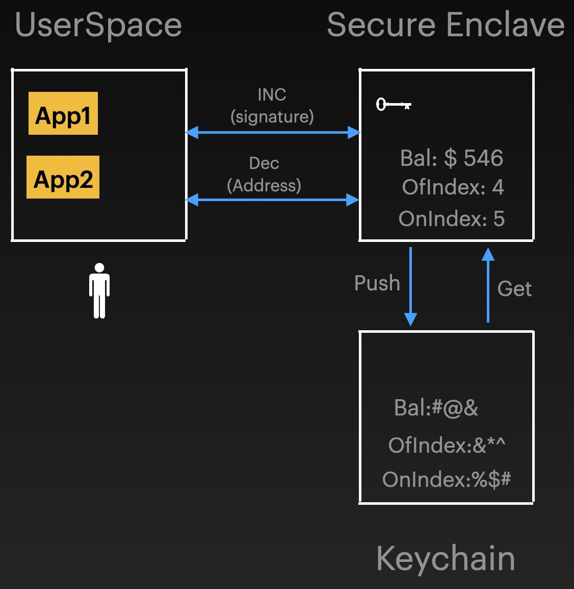

 **Here's the complete README file, incorporating all information and addressing potential redundancies:**

# Offline Payment Transaction iOS App

**Overview**

This iOS Xcode project demonstrates a secure method for conducting offline payment transactions between users. It utilizes encryption and Apple's Secure Enclave to protect sensitive data, enabling transactions even without a constant internet connection.

**Key Features**
* Freedom at your fingertips. Receive and spend money effortlessly, anytime, anywhere, with this revolutionary offline payment solution.
* Offline transaction processing
* Secure storage of balance and index data using the Secure Enclave
* Encryption with elliptic curve keys
* Digital signature verification
* Offline balance download and verification
* Offline balance transfer

Please note: To simplify the implementation, we have adopted a single-tier hierarchy allowing users to directly request funds from their online accounts managed by the central bank. In reality, a two-tier Central Bank Digital Currency (CBDC) architecture will be in place, requiring users to request their account balance from their intermediary bank.


**Understanding Secure Enclave and Keychain:**

**Secure Enclave:**

- A dedicated hardware component within Apple devices that offers a secure environment for sensitive data and operations.
- Key features:
    - Isolated from the main operating system and applications.
    - Stores sensitive data like private keys in encrypted form.
    - Processes sensitive operations within its secure boundaries.
    - Has its own processor for enhanced security and performance.
    - Communicates with other components through secure channels.

**Keychain:**

- A secure storage system used for passwords, certificates, and other sensitive information.
- Key features:
    - Data is encrypted and protected by system-level security measures.
    - Accessible only by the application that created the data.
    - Prevents unauthorized access to sensitive information.

**Architecture Overview of Our Solution:**
- 

1. **Data Storage:**
   - **Sensitive application data, including balance, is encrypted and stored in the Keychain, a secure system for sensitive data.**
   - **The application's private key is stored in an even more secure location, the Secure Enclave, a hardware-based security component.**
2. **Transaction Initiation:**
   - User requests a transaction through the application INC is receiving and DEC is for sending.
3. **Secure Enclave Access:**
   - Application sends a request to the Secure Enclave for sensitive operations.
4. **Processing and Verification (within Secure Enclave):**
   - Secure Enclave decrypts sensitive data from Keychain using the private key.
   - Processes transactions securely within its isolated environment.
   - Employs cryptographic techniques to protect against attacks.
5. **Data Update and Storage:**
   - Secure Enclave updates encrypted data in Keychain.
6. **Transaction Completion:**
   - Secure Enclave communicates results back to the application.

**Key Security Features:**

- Secure Enclave Isolation
- Encrypted Data Storage
- Secure Communication Channel
- Dedicated Processor
- Keychain Protection

**Additional Notes:**

- Real-world architecture might have variations.
- This architecture provides robust security for offline transactions and sensitive data management.


**Getting Started**

1. **Clone the project:**

   ```bash
   git clone https://github.com/AVSaiKumar/OfflineXcode.git
   ```

2. **Open the project in Xcode:**

   - Open the `OfflineService.xcodeproj` file.

3. **Run the project:**

   - Click the "Run" button to launch the simulator.


**4. Understanding the UI Screen**  
   
- 


The user interface displays key information about your wallet and transactions:

- Public Key: This is your wallet's unique identifier, used for secure transactions.
- Balance: This reflects your current available funds, updating as you send and receive payments.
- OnIndex (Online Index): This number increases each time you successfully add a token from the central server. It helps prevent replay attacks, ensuring transactions aren't duplicated.
- OffIndex (Offline Index): This number increases when you send tokens to others or receive and verify tokens offline. It similarly protects against replay attacks during offline transactions.

Key Points:

   - Both OnIndex and OffIndex play crucial roles in transaction security.
   - Their increments safeguard against unauthorized transaction duplication.
   - Copy public key from debug area: The public key will be printed in the debug area of Xcode. Copy it from there, as copying from the simulator can be difficult.

Here is the the video demo link of FligthPay - https://youtu.be/2HTEZrO1AZQ?si=gSM011yq4qFjY8ob

**Key Functionalities**

 **Online Balance to Offline Balance:**

   - **(Optional) Create a new central bank key:**
   - Run `python3 generate_keys.py` to create new bank keys.
   - Replace the contents of `public_key.pem` in `ContentView.swift` in the variable "publicKeyString" with the newly generated public key.
- **Generate a token:**
   - Run the `sign.py` Python file.
   - Enter the Index value one greater than the one displayed on the UI. For example, if the UI shows "5", enter "6".
   - This creates a token for the user on the central bank (Benhlaf or your newly created one).
   - copy this signature.
   
- **Add  balance to wallet :**
   - **Paste the signature** generated by `sign.py` into the signature field on the UI.
   - **Enter the same Index value and amount** used when creating the token.
   - **Press the "FromServer" button.**
   - The app verifies the signature using the central bank's public key.
   - If successful, the **balance and onIndex are incremented** securely in the Secure Enclave.
   - Note : Here manually we are pasting but actually these communication happens through internet https protocol web.

- **Replay attack prevention:**

  - **Index mismatch protection:**
     - The app prevents duplicate transactions using the same token. If you attempt to add the same token again, it will fail with an "index mismatch" status, indicating that the index value has already been used.
   - **Signature verification:**
      - If you try to modify the index value to a higher one for the same token, it will result in a signature error. This is because the signature was generated specifically for the original index value, ensuring the integrity of transactions.

- **Key takeaways:**

   - These measures effectively safeguard against replay attacks, ensuring that transactions cannot be fraudulently duplicated.
   - The use of indexes and signature verification strengthens the security of offline transactions.


** Offline to Offline Balance Transfer:**
- ** Initiate transfer:**
   - **Sender:**
      - Enter recipient's public key.
      - Enter the amount to send.
      - **Enter the exact Index value displayed on the receiver's UI.**
      - Press "Send" button.
   - **Token generation:**
      - App securely creates a token containing the sender's public key, amount, index, and signature using the Secure Enclave.
      - The signature is immediately displayed on the screen (copy from debug area if cursor interaction is difficult).
   
   - ** Receive and verify token:**
      - **Receiver:**
        - Paste the sender's signature into the signature field.
        - Enter the same amount and index used by the sender.
        - Enter the sender's public key.
        - Press "Verify and Increment Counter" button.
   - ** Secure verification and update:**
     - The Secure Enclave verifies the signature using the sender's public key.
     - If successful, the **balance and offIndex are securely incremented**.

   - ** Replay attack prevention (similar to Online Balance):**
      - Index mismatch protection
      - Signature verification

-**Key takeaways:**
   - Offline-to-offline transfers enable secure transactions without internet connectivity.
   - Precise index matching and signature verification ensure transaction integrity and prevent replay attacks.
   - The Secure Enclave safeguards sensitive data and processes transactions securely.
   - Similarly the receiver  can then choose to spend it immediately to other person or transfer it to their bank when online.

**Additional Information**

- **Key management:**
   - The application generates a private key during its first run and stores it securely in the Secure Enclave.
   - The public key is displayed in the user interface and used in transactions.
- **Signature generation and verification:**
   - The project includes Python scripts for signature creation and verification (`sign.py`).
   - Ensure you have the required Python package: `pip install cryptography`
- **Security considerations:**
   - Private keys are securely stored in the Secure Enclave.
   - All sensitive data is encrypted and decrypted using cryptographic methods.
   - Signature verification prevents unauthorized balance modifications.

**snpas**
- Lets see all the actions of screenshots
- user-1 intial data Balance 966, OffIndex 9, onIndex 2
- user-2 inital data Balance 160, Offindex 6, onIndex 1
   
- **1.user 1 home screen status
 - 
 
 - **user 1 debug console publicKey**
 - 
 
- **2. CentralServer creates token for user 1 with the details as amount 250, index 3**
 - 

- **Balance Reflectance on user1 on adding token**
 - 
 
- **Replay attack status shown for user 1 in debug console they are a.index mismatch b.Signature verification failed**
 - 

- **User 2 Home Screen**
 - 
 
- **User 1 trying to send $216 to user 2 for index 6**
 - 
 
 - **User 1 signature on his debug console**
  - 
  
 - **user 2 claiming token from user 1**
  - 
  
 - **Replay attack status shown for user 2 debug console they are a.index mismatch b.Signature verification failed**
  - 
 
Similarly, User 2 also can send the currency to User 1 or others or to his online wallet when he connect back to online.

here is the the video demo link of FligthPay - https://youtu.be/2HTEZrO1AZQ?si=gSM011yq4qFjY8ob

**For further assistance or inquiries, please refer to the project's GitHub repository or contact ms2204101012@iiti.ac.in.**
**NOte: Incase any issue in running the sign.py file to load balance from the bank, follow these steps: provide your public key, onIndex, present on Screen (initially '0'), and the desired amount. Email these details to ms2204101012@iiti.ac.in. We will manually generate a signature for you and email back to you. Afterwards, you can use this signature to load your balance.**
# SustPay1
